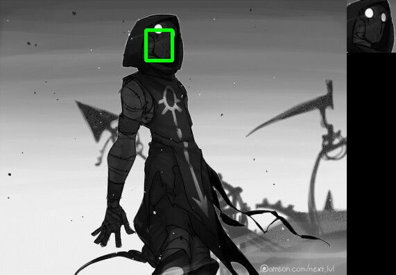

# cv_lab2
# Теория
### Template Matching
Сопоставление шаблонов - пошаговое сканирование шаблоном исходного изображения, причем на каждом шаге рассчитывается либо просто измеряется степень соответствия участка изображения существующему шаблону. Когда сканирование заканчивается, на изображении выделяется область, которая соответствует шаблону в большей степени [1].

### SIFT
SIFT является одним из наиболее распространённых алгоритмов для сравнения
изображений. Он инвариантен к поворотам объекта или камеры, изменениям масштаба
изображения или перемещению объекта на сцене.
Принцип работы алгоритма SIFT основан на поиске локальных максимумов в пространстве переменного масштаба [2].

# Описание разработанной системы
Была разработана программа на языке Python, которая реализует поиск двумя способами: template matching и sift.

# Результаты работы программы
#### Пример 1
Исходное изображение  
   
Шаблон  
   
Результаты Template matching  
  
Результаты SIFT в виде точек  
  
Результаты SIFT в виде прямоугольника  

#### Пример 2
Исходное изображение  
   
Шаблон  
   
Результаты Template matching  
  
Результаты SIFT в виде точек  
  
Результаты SIFT в виде прямоугольника  

#### Пример 3
Исходное изображение  
   
Шаблон  
   
Результаты Template matching  
  
Результаты SIFT в виде точек  
  
Результаты SIFT в виде прямоугольника  

#### Пример 4
Исходное изображение  
   
Шаблон  
   
Результаты Template matching  
  
Результаты SIFT в виде точек  
  
Результаты SIFT в виде прямоугольника  

#### Пример 5
Исходное изображение  
   
Шаблон  
   
Результаты Template matching  
  
Результаты SIFT в виде точек  
  
Результаты SIFT в виде прямоугольника  

#### Пример 6
Исходное изображение  
   
Шаблон  
   
Результаты Template matching  
Сходства не нашел.  
Результаты SIFT в виде точек  
  
Результаты SIFT в виде прямоугольника  

#### Пример 7
Исходное изображение  
   
Шаблон  
   
Результаты Template matching  
  
Результаты SIFT в виде точек  
  
Результаты SIFT в виде прямоугольника  

#### Пример 8
Исходное изображение  
   
Шаблон  
   
Результаты Template matching  
  
Результаты SIFT в виде точек  
  
Результаты SIFT в виде прямоугольника  

#### Пример 9
Исходное изображение  
   
Шаблон  
   
Результаты Template matching  
  
Результаты SIFT в виде точек  
  
Результаты SIFT в виде прямоугольника  

#### Пример 10
Исходное изображение  
   
Шаблон  
   
Результаты Template matching  
  
Результаты SIFT в виде точек  
  
Результаты SIFT в виде прямоугольника  

# Выводы по работе
В результате работы программы можно сделать вывод, что SIFT лучше работает при изменении ракурса/масштаба/положения искомого объекта. Его недостатком является большие требования к вычислительным ресурсам.

# Использованные источники
[1] https://otus.ru/nest/post/2478/
[2] https://bstudy.net/857771/tehnika/algoritm_sift
